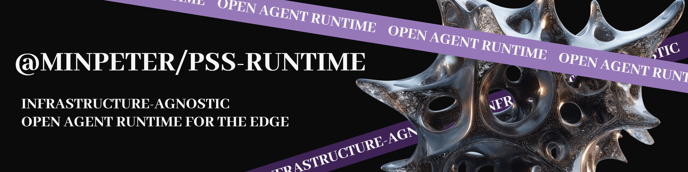

<p align="center">
  
</p>

# Plugsuits

> Just want the terminal agent? [`apps/coding-agent`](apps/coding-agent/README.md)
> opens with the install steps for the `pss` TUI and the `pss exec` runner.

Small agent runtime workspace, and the successor to
[minpeter/plugsuits](https://github.com/minpeter/plugsuits). Everything ships
under the `pss` prefix, short for Plugsuits.

- [`@minpeter/pss-runtime`](packages/runtime/README.md): runtime, threads,
  model loop, core hooks, storage, and instrumentation.
- [`@minpeter/pss-coding-agent`](apps/coding-agent/README.md): model wiring,
  workspace coding tools, the `pss` TUI, and the `pss exec` headless runner.
- `apps/worker-agent` (private, never published): the Cloudflare Worker
  transport and chat bot front, with an unauthenticated `/healthz` probe and
  bounded wide-event metrics — see
  [docs/worker-agent.md](docs/worker-agent.md) and its
  [README](apps/worker-agent/README.md).

## Use

```ts
import { createOpenAICompatible } from "@ai-sdk/openai-compatible";
import { createAgent } from "@minpeter/pss-runtime";

const provider = createOpenAICompatible({
  name: "custom",
  apiKey: process.env.AI_API_KEY,
  baseURL: process.env.AI_BASE_URL,
});

const agent = await createAgent({
  instructions: "Keep every answer under 3 lines.",
  model: provider(process.env.AI_MODEL ?? "minimax/MiniMax-M3"),
});

const thread = agent.thread("default");
const turn = await thread.send("Hello");

for await (const event of turn.events()) {
  console.dir(event, { depth: null });
}
```

`turn.events()` drives the turn. The runtime waits at `turn-start`,
`step-start`, and `step-end` until the consumer continues, so consume the
events to let the turn progress.

## Development

Requires Node 24 and pnpm 11.9; run `pnpm install --frozen-lockfile` after
cloning. The local quality gate runs entirely offline:

- `pnpm lint` / `pnpm typecheck` — static analysis and project checks.
- `pnpm test` — package tests plus the repository invariant suite.
- `pnpm build` / `pnpm coverage` — full workspace build and the coverage gate.
- `pnpm api:check` / `pnpm verify:edge` — runtime API snapshot check and the
  Worker edge-bundle dry run.
- `pnpm check:unused` / `pnpm check:duplicates` — Knip unused-code and jscpd
  duplicate-code gates against reviewed baselines.
- `pnpm check:workspace-drift` / `pnpm check:bundle-size` — workspace
  dependency-version drift (including optional dependencies) and built
  bundle-size budgets for entrypoints and complete published `dist/` trees.
  Both commands run their gates by default; build before checking bundle size.
- Add a dated `.tegami/YYYY-MM-DD-slug.md` entry before merging each PR,
  following the [release-note format](AGENTS.md#tegami-entries), and validate
  it with `pnpm check:tegami-notes`.
- `pnpm check:compatibility` / `pnpm repo:packages` — the Pi compatibility
  manifest and package-boundary/release checks.
- `pnpm check:worker-api-contract` — the Worker OpenAPI contract against the
  committed observed-behavior records. The Worker package also owns an
  independent coverage gate
  (`pnpm --filter @minpeter/pss-worker-agent test:coverage`).

The coding-agent CLI is validated from built output, never a source shim:
run `pnpm build` first, then probe `node apps/coding-agent/bin/pss.js --help`, which
exits 0 and lists the command entrypoints (`pss exec --help` prints the
exec usage). The documented error probes are closed-loop: an invalid
`pss exec` invocation exits 1 with the static stderr line `Invalid pss exec option.`,
and a misconfigured model environment exits 1 with bounded setup help. Both
paths terminate immediately with no provider credential, no model call, and
no listening port.

The public API snapshot (`pnpm api:check`) is the runtime API contract. The
repository intentionally carries no TypeDoc dependency or script: the
installed TypeScript 7 toolchain is outside TypeDoc's supported range, so the
snapshot — not generated documentation — remains the contract of record.

See [CONTRIBUTING.md](CONTRIBUTING.md) for the QA and evidence rules and the
[operational runbooks](docs/runbooks/README.md) for CI triage, release, and
local Worker validation procedures.

## Operational boundaries

Some readiness controls are external-only: they cannot be configured or
verified from repository files or local commands, so this repository documents
them as deferred rather than claiming them as active. Branch protection
enforcement and native secret scanning are deferred and external; hosted
analytics, hosted error tracking, and hosted alerting are deferred and
external; progressive rollout and automated rollback are deferred and
external; and production deployment and health monitoring of the Worker are
deferred and external. The authoritative deferred list, and the repo-local
substitute for each control, lives in
[docs/deferred-controls.md](docs/deferred-controls.md).

## Security

Found a vulnerability? Follow the [security policy](SECURITY.md) to report it
privately through GitHub's built-in private vulnerability reporting.

## License

This project is licensed under the [Sustainable Use License](LICENSE.md).

You can use, modify, and distribute it for free for internal business,
non-commercial, or personal use. Reselling it or offering it as a paid product
or service requires a separate commercial license.
