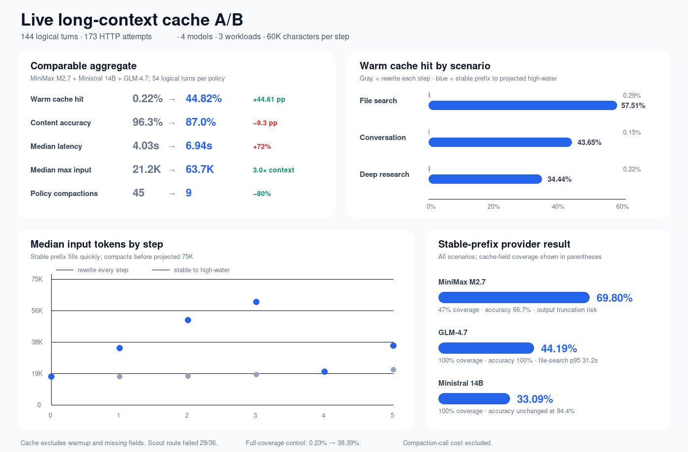

# Live long-context cache policy campaign

This report records a live Freerouter campaign completed on 2026-07-17. It
extends the smaller cache-telemetry probe with fast-growing, task-bearing
contexts: repository search, long conversation state, and conflicting-source
research. The campaign contains 144 logical eval turns executed through 173
HTTP attempts (115 turns used one attempt and 29 used two).



[Vector source](./2026-07-17-broad-context.svg)

## Headline result

For the three routes that completed every logical turn (MiniMax M2.7, Ministral
14B, and GLM-4.7), keeping the prefix stable until a projected 75,000-token
high-water mark changed the aggregate warm cache hit rate from **0.22% to
44.82%** and reduced policy compactions from **45 to 9**. It was not a free
win: content accuracy fell from **96.3% to 87.0%**, median latency rose from
**4.03 s to 6.94 s**, and the median per-run maximum context grew from **21.2K
to 63.7K input tokens**.

```text
                                      rewrite every step       stable to high-water
Warm cache hit                         0.22%  ▏                 44.82%  ██████████████████
Content accuracy                      96.30%  ██████████████████████████████████████
                                                                 87.04%  ███████████████████████████████████
Median latency                         4.03s  ███████████          6.94s  ███████████████████
Median max input                      21.2K  ███████████          63.7K  ████████████████████████████████
Compactions                               45  ████████████████████████████████████████
                                                                      9  ████████
```

The cache-rate improvement is **+44.61 percentage points**, while compaction
frequency is **80% lower**. The result also shows why cache hit rate cannot be
the only optimization target. On the two providers with 100% raw cache-field
coverage (Ministral and GLM), the exact token control was **0.23% → 38.39%**:
stable-prefix warm turns carried 484,780 cached tokens out of 1,262,888 input,
versus 1,339 out of 575,764 for rewrite-every-step. Even after subtracting
reported cache reads, uncached input was 778,108 versus 574,425 tokens:
**35.5% more**. The deterministic compaction-summary generation cost was
intentionally not included, so this uncached-token comparison favors the
rewrite policy.

## What was tested

The campaign ran 144 logical `/chat/completions` eval turns: four models, three
scenarios, two policies, and six steps per policy run. Retries raised the
actual network total to 173 HTTP attempts. Each step appended approximately
60,000 characters, producing roughly 14K–21K provider-reported input tokens on
the first step and filling context rapidly.

| Scenario | Workload | Cache hit: rewrite → stable | Accuracy: rewrite → stable | Largest stable prompt |
|---|---|---:|---:|---:|
| Large file search | 239 non-test TypeScript files under `packages/runtime/src`, about 810K source characters; locate exported symbols across old and new chunks | 0.29% → 57.51% | 94.4% → 83.3% | 61,418 |
| Long conversation | Noisy project dialogue with explicit confirmed decisions that supersede old facts | 0.15% → 43.65% | 100.0% → 100.0% | 67,652 |
| Deep research | Large distractor corpus; select the newest source that is both primary and active, rejecting newer secondary or retracted sources | 0.22% → 34.44% | 94.4% → 77.8% | 70,426 |

Scenario rows exclude Llama Scout because its route was not healthy enough for
a paired comparison. Accuracy checks whether the response contains the exact
expected evidence tokens; it is not a general model-quality score.

## Policy isolation

`legacy-rewrite-every-step` replaced all prior messages with a compact durable
state after every completed step. `high-water-stable-prefix` appended messages
byte-stably and compacted only when the next projected 60K-character chunk
would cross 75,000 input tokens. Both policies used the same deterministic,
ground-truth summary. This removes summary-model variance and isolates prefix
stability, context growth, and provider caching.

The median prompt-size trajectory across the three comparable routes and all
three scenarios makes the difference visible:

| Step | 0 | 1 | 2 | 3 | 4 | 5 |
|---|---:|---:|---:|---:|---:|---:|
| Rewrite every step | 17.0K | 17.0K | 17.2K | 18.1K | 19.9K | 21.2K |
| Stable to high-water | 17.0K | 33.9K | 50.8K | 61.4K | 19.9K | 35.4K |

The stable policy forms a sawtooth: it reuses an increasingly large prefix,
compacts before the following chunk would cross the high-water mark, and then
starts growing again. Each six-step run compacted once instead of five times.

## Model and route results

Values below aggregate all three scenarios. Cache rates exclude step 0 and use
only successful responses that reported both input and cached tokens. Coverage
is therefore shown next to every rate.

| Model | Route success (logical turns), rewrite → stable | Cache hit, rewrite → stable | Cache-field coverage, rewrite → stable | Accuracy, rewrite → stable | p50 latency, rewrite → stable | Max stable input |
|---|---:|---:|---:|---:|---:|---:|
| MiniMax M2.7 (204.8K) | 18/18 → 18/18 | 0.11% → 69.80% | 33% → 47% | 94.4% → 66.7% | 7.30s → 8.52s | 69,571 |
| Ministral 14B (262.1K) | 18/18 → 18/18 | 0.19% → 33.09% | 100% → 100% | 94.4% → 94.4% | 3.58s → 4.91s | 63,678 |
| GLM-4.7 (202.8K) | 18/18 → 18/18 | 0.29% → 44.19% | 100% → 100% | 100% → 100% | 3.20s → 8.63s | 70,426 |
| Llama 4 Scout (10.5M) | 5/18 → 2/18 | 0% on successful warm responses | 4/4 → 2/2 warm responses | 27.8% → 11.1% overall | 17.42s → 18.44s on successes | 35,112 |

MiniMax's lower stable-prefix accuracy came mostly from `finish_reason=length`
responses that spent the small output allowance without returning the required
evidence. Ministral retained accuracy with a moderate cache gain. GLM retained
accuracy and cache reuse but developed a large tail, including a 31.2 s p95 in
file search. Llama Scout returned repeated upstream empty-assistant-response
errors, so its row is availability evidence rather than a fair model or context
window result.

## Interpretation

The technique that clearly worked was preserving an identical prefix through
multiple fast-growing turns. Rewriting even a correct summary every turn made
the provider-observed cache rate effectively zero. Batching that rewrite until
a high-water boundary exposed large reusable prefixes on MiniMax, Ministral,
and GLM.

The broader workloads also reject a simplistic “maximize hit rate” policy:

- Long conversation state was the clean win: 43.65% cache hit with no accuracy
  loss.
- Repository search gained the most cache reuse, but MiniMax output truncation
  reduced aggregate accuracy and GLM added a long latency tail.
- Conflicting-source research was the hardest workload. Larger live context
  raised distraction and truncation risk; stable-prefix accuracy was 16.7
  percentage points lower.
- More cached tokens did not mean fewer uncached tokens, because stable-prefix
  prompts were much larger. Cache rate, uncached tokens per correct answer,
  accuracy, and p95 latency must be evaluated together.

The evidence supports a model- and workload-aware hybrid rather than a single
global threshold: keep immutable instructions, tool schemas, and durable indexes
byte-stable; append confirmed state changes; compact at semantic checkpoints or
a measured token high-water; reserve enough output tokens for reasoning models;
and fail the eval when cache telemetry coverage is too low to trust the rate.
A 45K–60K starting high-water is worth a follow-up sweep for MiniMax and
research-heavy workloads, while Ministral and GLM can be evaluated at higher
thresholds with explicit p95 gates.

## Measurement boundaries

This was a direct OpenAI-compatible protocol A/B against the user-specified
Freerouter endpoint. It used real hosted models, but it did **not** run these
three policy scenarios through PSS automatic compaction. The separate
[live-provider telemetry campaign](./README.md) verifies the actual PSS
`Agent` → `model-usage` → eval aggregation path. The broad policy campaign uses
oracle summaries and excludes summary-generation calls, so it validates policy
behavior and upstream cache reporting, not current-runtime end-to-end cost.

Provider `cached_tokens` omission is not treated as zero. The checked-in
[sanitized snapshot](./2026-07-17-broad-context.json) records per-turn status,
token counts, cache-field presence, correctness, latency, finish reason, and
source-artifact hashes. It contains no API key, prompt, raw body, or model
output. The file-search workload did send the repository source corpus to the
configured external endpoint during the authorized live test.
