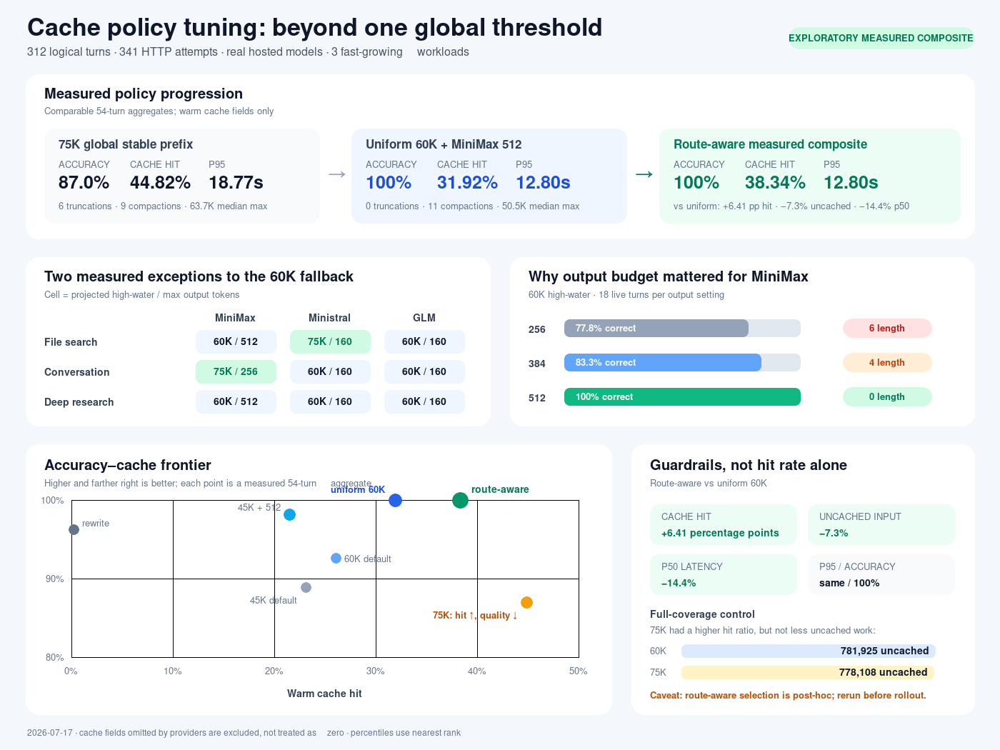

# Live cache-policy tuning follow-up

This follow-up adds **168 live logical turns and 168 HTTP attempts** to the
2026-07-17 Freerouter campaign. Together with the parent campaign, the evidence
base is **312 logical turns / 341 HTTP attempts**. It covers three real hosted
models, three fast-growing workloads, two new projected high-water marks, and
a MiniMax output-budget sweep.

[Vector source](./2026-07-17-policy-tuning.svg) · [sanitized follow-up
snapshot](./2026-07-17-policy-tuning.json) · [parent 75K
campaign](./2026-07-17-broad-context.md)

## Result

The best uniform policy tested was a **60K projected input-token high-water**
with `max_tokens=512` for MiniMax and 160 for Ministral and GLM. It reached
54/54 exact expected-token recall, 31.92% warm cache hit, 12.798 s p95, 11
compactions, and no length finishes.

A conservative route-aware composite improves that measured result further:

- Use 75K for Ministral file search and MiniMax conversation.
- Use 60K for every other route.
- Give MiniMax 512 output tokens for file search and deep research, but retain
  256 for conversation; Ministral and GLM retain 160.

That composite keeps **54/54 exact expected-token recall and the same 12.798 s
p95**, while moving cache hit from **31.92% to 38.34%**, reducing tracked
uncached input by **7.3%**, reducing p50 from **6.514 s to 5.579 s**, and keeping
compactions at 11. Its median per-run maximum context is nearly unchanged at
50,806 tokens, but its absolute maximum rises 27.1% to 67,303 tokens.

The composite is a post-hoc assembly of measured live route runs, not a new
interleaved confirmation run. It is therefore the **exploratory best measured
policy**; the uniform 60K policy remains the safer deployment default until
the two 75K exceptions are independently replicated.

## Candidate comparison

Cache rates exclude step 0 and include only successful warm turns that reported
both input and cached-token fields. Latency percentiles use nearest rank.

| Policy | Accuracy | Warm cache hit | p50 | p95 | Median run max input | Compactions | Length finishes |
|---|---:|---:|---:|---:|---:|---:|---:|
| Rewrite every step | 96.30% | 0.22% | 4.031 s | 12.875 s | 21,230 | 45 | 4 |
| Stable 45K, default output | 88.89% | 23.08% | 5.975 s | 14.602 s | 35,394 | 18 | 6 |
| Stable 60K, default output | 92.59% | 26.08% | 6.734 s | 16.208 s | 50,481 | 11 | 6 |
| Stable 75K, default output | 87.04% | 44.82% | 6.940 s | 18.771 s | 63,678 | 9 | 6 |
| Stable 45K, MiniMax 512 | 98.15% | 21.49% | 6.228 s | 15.473 s | 35,394 | 18 | 1 |
| **Uniform 60K, MiniMax 512** | **100.00%** | **31.92%** | **6.514 s** | **12.798 s** | **50,481** | **11** | **0** |
| **Route-aware measured composite** | **100.00%** | **38.34%** | **5.579 s** | **12.798 s** | **50,806** | **11** | **0** |

Relative to the original 75K stable-prefix policy, the route-aware composite
recovers **+12.96 percentage points of accuracy**, cuts p50 by **19.6%**, cuts
p95 by **31.8%**, and removes all six truncations while giving back 6.49 cache
percentage points. Relative to rewrite-every-step, it adds 38.12 cache points
and cuts compactions by 75.6%; p50 is still 38.4% slower, while p95 is 0.6%
lower.

## Policy matrix

| Workload | MiniMax M2.7 | Ministral 14B | GLM-4.7 |
|---|---:|---:|---:|
| Large file search | 60K / 512 output | **75K / 160 output** | 60K / 160 output |
| Long conversation | **75K / 256 output** | 60K / 160 output | 60K / 160 output |
| Deep research | 60K / 512 output | 60K / 160 output | 60K / 160 output |

Only two routes differ from the uniform fallback. Both 75K substitutions had
6/6 correctness, zero length finishes, and did not worsen the workload-level
p95. All other observed 75K or 45K substitutions were rejected when they lost
accuracy, increased truncation risk, or worsened the workload tail.

## Techniques that changed the result

1. **Keep the reusable prefix byte-stable.** Immutable instructions, tool
   schemas, indexes, and accepted state remain in place until a measured
   high-water boundary. Rewriting a correct summary every turn still produced
   only 0.22% aggregate cache hit.
2. **Compact on projected input size, not turn count.** The harness estimates
   the next 60K-character append and compacts before it crosses the route's
   high-water mark. The 60K fallback cut compactions from 45 to 11 without
   filling context to the 75K policy's 63.7K median maximum.
3. **Budget output separately from context.** MiniMax needed 512 output tokens
   in search and research. Increasing context alone raised cache hit but did
   not prevent `finish_reason=length` failures.
4. **Use narrow, measured exceptions.** The route-aware candidate raises the
   threshold only where the same route retained exact correctness and tail
   latency. It does not globally chase the highest observed cache rate.
5. **Gate cache claims on telemetry coverage.** Omitted cached-token fields are
   not converted to zero. Every aggregate records warm-field coverage and uses
   token-weighted `sum(cached) / sum(input)`.
6. **Optimize the joint guardrail.** Selection requires correctness, length
   finishes, p95, uncached input, context size, and compactions in addition to
   cache hit.

## MiniMax output sweep

The 60K threshold alone did not solve MiniMax truncation. The output sweep did.

| MiniMax output budget | Correct | Length finishes | Warm cache hit | Coverage | p95 |
|---|---:|---:|---:|---:|---:|
| 256 | 14/18 | 6 | 22.35% | 8/15 | 59.848 s |
| 384 | 15/18 | 4 | 31.61% | 6/15 | 12.341 s |
| **512** | **18/18** | **0** | **49.16%** | **8/15** | 28.781 s |

The 512-token deep-research replicate also reached 6/6 correctness with zero
length finishes; its p95 was 17.514 s versus 28.781 s in the first run. This
supports 512 as the minimum safe value among those tested, while also showing
that single-run tail latency is noisy.

## Route-aware workload result

| Workload | Correct | Warm cache hit | Coverage | p50 | p95 | Max input |
|---|---:|---:|---:|---:|---:|---:|
| Large file search | 18/18 | 51.30% | 12/15 | 5.400 s | 16.465 s | 61,418 |
| Long conversation | 18/18 | 32.71% | 13/15 | 5.645 s | 9.053 s | 67,303 |
| Deep research | 18/18 | 31.17% | 13/15 | 5.579 s | 28.781 s | 52,953 |

Deep research remains the tail-risk workload despite perfect exact-token
recall. The aggregate p95 is lower because the 28.781 s event is a single
outlier among 54 turns; production gates should retain per-workload p95 rather
than relying only on the global percentile.

## Full-coverage provider control

Ministral and GLM reported cache fields for every warm turn, so their token
totals isolate the effect of prompt growth without MiniMax's missing fields.

| Stable high-water | Correct | Input tokens | Cached tokens | Uncached tokens | Cache hit | p95 |
|---|---:|---:|---:|---:|---:|---:|
| 45K | 36/36 | 886,264 | 220,837 | 665,427 | 24.92% | 15.473 s |
| 60K | 36/36 | 1,073,011 | 291,086 | 781,925 | 27.13% | 10.543 s |
| 75K parent | 35/36 | 1,262,888 | 484,780 | 778,108 | 38.39% | 19.544 s |

The 75K control reports a much higher hit rate, yet its uncached input is
almost identical to 60K: 778,108 versus 781,925 tokens. Larger cached prompts
can improve the ratio without reducing the amount billed or processed as
uncached input. This is why hit rate is a signal, not the objective by itself.

## What was actually run

The follow-up made 168 direct OpenAI-compatible `/chat/completions` requests:

- 54 turns at 45K with default outputs;
- 54 turns at 60K with default outputs;
- 18 turns at 60K with MiniMax output 384;
- 18 turns at 60K with MiniMax output 512;
- 6 MiniMax 60K/512 deep-research replicate turns; and
- 18 turns at 45K with MiniMax output 512.

Every follow-up logical turn used exactly one HTTP attempt. The routes were
`minimaxai/minimax-m2.7`, `mistralai/ministral-14b-latest`, and
`zai-org/glm-4.7`. Each run had six fast-growing steps of approximately 60,000
characters. The correctness column is a narrow exact expected-token recall
proxy: the response had to contain the expected evidence tokens for repository
paths, superseding conversation facts, or primary-active research sources. It
does not score continuation quality, unsupported extra claims, false positives,
or hallucinations.

The route-aware 54-turn row is composed from 42 follow-up turns and 12 parent
75K turns. Every component is a real hosted-model response, but the matrix was
selected after seeing those runs. It must be rerun in randomized or interleaved
order before treating the observed deltas as predictive.

## Measurement boundaries

This policy campaign exercises real hosted models and upstream cache reporting,
but it does not run these scenarios through PSS automatic compaction. It uses
the same deterministic oracle durable-state summary for every policy, and no
summary-model call is made or timed. The separate [PSS telemetry
campaign](./README.md) validates the actual `Agent` → `model-usage` → eval
aggregation path.

Router placement, cache population, and latency can vary between calls. The
sample is intentionally stressful but small, and exact-token correctness is
not a general model-quality score. The checked-in JSON contains only metadata,
token counts, status, finish reason, correctness, latency, and artifact hashes.
It contains no credential, prompt, raw request or response body, or model
output.
