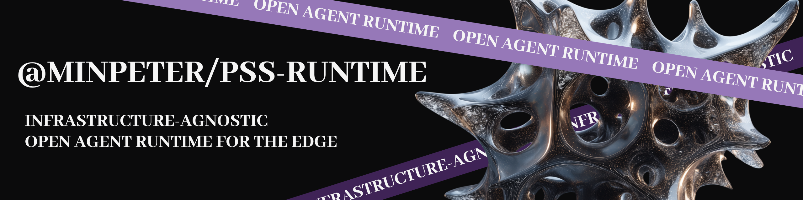

<p align="center">
  
</p>

# @minpeter/pss-runtime

Minimal, platform-agnostic agent runtime with keyed threads, synchronized
`turn.events()`, and opaque persistence contracts.

## Core DX

```ts
import { createOpenAICompatible } from "@ai-sdk/openai-compatible";
import { Agent } from "@minpeter/pss-runtime";
import { createEnv } from "@t3-oss/env-core";
import { config as loadEnv } from "dotenv";
import { z } from "zod";

loadEnv({ path: ".env", quiet: true, override: true });
const env = createEnv({
  runtimeEnv: process.env,
  server: {
    AI_API_KEY: z.string().trim().min(1),
    AI_BASE_URL: z.url().trim().default("https://apis.opengateway.ai/v1"),
    AI_MODEL: z.string().trim().min(1).default("minimax/MiniMax-M2.7"),
  },
});

const provider = createOpenAICompatible({
  name: "custom",
  apiKey: env.AI_API_KEY,
  baseURL: env.AI_BASE_URL,
});

const agent = new Agent({
  instructions: "Answer briefly.",
  model: provider(env.AI_MODEL),
});

const turn = await agent.send("Hello");
for await (const event of turn.events()) {
  console.log(event);
}
```

`turn.events()` is the turn driver. The runtime stops at synchronized lifecycle
boundaries until the events consumer asks for the next event, so callers must
consume the events for the turn to progress. This is what lets code react to
`turn-start`, `step-start`, and `step-end` before the next model snapshot is
created.

`model` is the single public constructor key for model execution. Pass an AI SDK
`LanguageModel` object and configure runtime-owned prompting through
`instructions`, `tools`, and `toolChoice`:

```ts
import { openai } from "@ai-sdk/openai";
import { Agent } from "@minpeter/pss-runtime";

const model = openai("gpt-4.1-mini");

const agent = new Agent({
  instructions: "Answer with concise operational notes.",
  model,
});
```

Per-key conversations use `thread(key)`:

```ts
const roomThread = agent.thread("room:123:user:456");
const turn = await roomThread.send(["Context: user prefers short answers", "Hi"]);
for await (const event of turn.events()) {
  // events for this single turn
}
```

`agent.send(...)` is shorthand for `agent.thread("default").send(...)`.

For model providers that support multimodal input, send JSON-serializable content
parts through the same API. String input and `readonly string[]` remain supported
shortcuts for text-only turns.

```ts
const turn = await agent.send([
  { type: "text", text: "Describe this UI screenshot." },
  {
    type: "image",
    image: "data:image/png;base64,iVBORw0KGgo...",
    mediaType: "image/png",
  },
]);
```

File parts use the same JSON-serializable shape when the selected model supports
file input:

```ts
await agent.send([
  { type: "text", text: "Summarize the attached report." },
  {
    type: "file",
    data: "data:application/pdf;base64,JVBERi0x...",
    filename: "report.pdf",
    mediaType: "application/pdf",
  },
]);
```

The runtime normalizes and persists these content parts as thread continuation
state; it does not fetch remote media, decode files, or guarantee provider support
for every media type.

The public transcript protocol is `AgentEvent`: live turns emit runtime-defined
events through `turn.events()`. Provider/model message history is internal
continuation state, not a public history API.

## Delegation

Delegation is app-owned. Build ordinary tools that call another `Agent`,
`thread.send(...)`, notification resume, or host-owned background work, then
return the compact result shape your product wants the model to see.

```ts
const reader = new Agent({
  instructions: "Read knowledge-base files and cite paths.",
  model,
  namespace: "reader",
});

const coordinator = new Agent({
  instructions: "Coordinate work and delegate knowledge-base reads.",
  model,
  namespace: "coordinator",
  tools: {
    delegate_to_reader: tool({
      description: "Ask the reader agent to inspect the knowledge base.",
      execute: async ({ prompt }) => {
        const turn = await reader.thread("kb").send(prompt);
        const text: string[] = [];
        for await (const event of turn.events()) {
          if (event.type === "assistant-output") {
            text.push(event.text);
          }
        }
        return { result: text.join("\n") };
      },
      inputSchema,
    }),
  },
});
```

For background delegation, let your host own task ids, scheduling, output
storage, and notification resume. The runtime provides generic execution stores,
notifications, `Agent.resume(...)`, and `turn.events()`; it does not generate
delegation tools or own child-agent lifecycle semantics. See
the sync and background example packages for app-owned blocking and background
delegation patterns.

## Plugins

Pass `plugins: [...]` on `Agent` to observe or intercept runtime events. Each
plugin exposes one handler:

```ts
import type { AgentPlugin } from "@minpeter/pss-runtime";
import { Agent } from "@minpeter/pss-runtime";

const tracePlugin: AgentPlugin = {
  name: "trace",
  on: ({ event }) => {
    if (event.type === "turn-end") {
      console.log("turn finished");
    }
  },
};

const agent = new Agent({
  model,
  plugins: [tracePlugin],
});
```

### Observe vs intercept

For most events, `on` is observe-only: return nothing (or `{ action: "continue" }`)
and the runtime emits the event unchanged.

Two input event types support intercept returns:

- `user-input`
- `runtime-input`

Return one of:

- `{ action: "continue" }` — emit the current event (default when omitted)
- `{ action: "transform", event }` — emit a replacement input event
- `{ action: "handled" }` — skip emit; for `thread.send`, close the run without
  starting a turn

Plugins run in registration order. Each `transform` updates the event seen by
later plugins, so transforms chain sequentially.

### Tool-call interception

Plugins can also expose `onToolCall` to inspect a tool call after the runtime
writes the `before-tool` checkpoint and before the tool's `execute` function
runs:

```ts
import type { AgentPlugin } from "@minpeter/pss-runtime";

const approvalPlugin: AgentPlugin = {
  name: "approval",
  onToolCall: ({ capabilities, toolName }) => {
    const writesFiles = capabilities.some(
      (capability) => capability.kind === "filesystem"
    );
    if (writesFiles && toolName !== "approved_write") {
      return { action: "needs-recovery" };
    }
    return { action: "continue" };
  },
};
```

`onToolCall` receives `toolName`, `toolCallId`, `input`, `policy`, `attempt`,
`idempotencyKey`, normalized `capabilities`, current model-message `history`,
and `signal`. Returning `{ action: "needs-recovery" }` stops before real tool
execution and marks the durable run for manual recovery. Returning
`{ action: "continue" }`, returning nothing, or returning an invalid value lets
execution continue. The hook does not transform inputs or inject outputs.

Tool definitions may declare top-level runtime metadata next to AI SDK tool
fields:

```ts
const tools = {
  write_file: {
    ...tool({ execute: writeFile, inputSchema }),
    capabilities: [
      { kind: "filesystem", operations: ["write"], scope: "workspace" },
      { kind: "human-approval", reason: "writes files" },
    ],
    retryPolicy: "manual-recovery",
  },
};
```

Capability metadata is treated as untrusted runtime metadata. The runtime only
preserves arrays of objects with a string `kind`; malformed capability metadata
normalizes to an empty list and is not persisted.

### Input `meta.source`

The runtime attaches `meta` on input events at API boundaries. Plugins can route
on `event.meta?.source`:

| `source` | Boundary |
|----------|----------|
| `send` | `thread.send()` / `agent.send()` |
| `steer` | `thread.steer()` and drained steering queue |
| `notify` | host notification runtime input |
| `delegate` | parent `delegate_to_*` child `thread.send()` |

`meta` appears on `turn.events()` for input events but is stripped before thread
history persistence and model mapping. It never reaches the LLM prompt.

### Delegate prompt wrapping

Child agents receive delegated prompts with `meta.source === "delegate"`. Wrap or
rewrite text input with a plugin instead of agent-level prompt shims:

```ts
import type { AgentPlugin, UserText } from "@minpeter/pss-runtime";
import { Agent } from "@minpeter/pss-runtime";

const pokeTagsPlugin: AgentPlugin = {
  name: "poke-tags",
  on: ({ event }) => {
    if (
      event.type !== "user-input" ||
      event.meta?.source !== "delegate" ||
      !("text" in event)
    ) {
      return;
    }

    const text =
      typeof event.text === "string" ? event.text : event.text.join("\n");

    return {
      action: "transform",
      event: {
        ...event,
        text: `<poke>\n${text}\n</poke>`,
      } satisfies UserText,
    };
  },
};

const executionAgent = new Agent({
  namespace: "execution",
  plugins: [pokeTagsPlugin],
  model,
});
```

The parent coordinator stays unchanged; only the nested child agent carries the
plugin.

## Send, Host Resume, and Steer

Use `thread.send(input)` for a new user turn. If a turn is already active, the
turn is queued until the active turn finishes. Use `thread.steer(input)` when
the input should steer the active turn; if no turn is active, it starts a normal
turn.

Durable hosts resume completed background work by writing a notification record
and calling `agent.resume(notificationRunId)`. The resume call claims the
notification idempotently through its durable run id and returns one `AgentTurn`,
or `null` when a duplicate queue/alarm delivery already claimed it.

`agent.resume(runId)` also returns `null` when the host does not support durable
resume (`agent.supportsResume === false`); it never throws for an unsupported
host. Check `supportsResume` first when you need to distinguish an unsupported
host from a missing or already-claimed run.

Runtime-originated input is delivered through the host notification inbox and
internal plugin paths. App code should use `thread.send()`, `thread.steer()`,
or `agent.resume(runId)` for host-scheduled durable work.

Each accepted call returns one `AgentTurn`. Drain that turn's `events()` stream to
observe the turn; each `AgentTurn.events()` stream is single-consumer.

Input APIs accept strings, arrays of strings, or multipart arrays such as
`[{ type: "text", text: "hello" }, { type: "image", image }]`. The runtime
normalizes accepted `send` input into `user-input` events. Active steering and
host resume input emit `runtime-input` events. A `runtime-input` is
runtime/API-originated input mapped internally to the model's user role. It is
distinct from human-origin `user-input` events.

Runtime input windows are tied to synchronized events:

- `turn-start`: input is appended after the original turn input and before the first model snapshot.
- `step-start`: input is appended before that same step's model snapshot.
- `step-end`: input is appended before the next step and intentionally continues the current turn, even if the assistant text looked final.

Guard `step-end` insertion with a one-shot flag or a real condition. Adding input
on every `step-end` can keep the turn running indefinitely.

```ts
const thread = agent.thread("room:123:user:456");
const turn = await thread.send("Draft a short answer.");
let addedSteer = false;

for await (const event of turn.events()) {
  if (event.type === "assistant-output") {
    process.stdout.write(event.text);
  }

  if (event.type === "step-end" && !addedSteer) {
    addedSteer = true;
    await thread.steer("Also mention the main tradeoff.");
  }
}
```

`thread.steer()` resolves when the input is accepted into the active turn's
pending steering path or, when idle, when a new turn is scheduled. It does not wait
for a later model snapshot.

## Thread Storage and Portability

The runtime owns full thread state encoding and history compaction semantics.
Adapters own persistence only through `ThreadStore`:

Stored thread state is an opaque, versioned runtime snapshot for continuation.
Do not inspect it as a replay log; exact replay should be modeled separately as
an `AgentEvent` log if that capability is added later.

`ThreadStore` is snapshot-only. It does not own background task ids, run
leases, checkpoints, notification inbox state, or scheduling. Those live on the
optional `host` execution contract.

Custom stores own version generation. `load(key)` returns the opaque `state` with
the store-minted `version`; `commit(key, { state }, { expectedVersion })` receives
state only and should reject stale versions by returning `{ ok: false, reason:
"conflict" }`. On success, the store persists `{ state, version }` and returns the
new version to the runtime. `delete(key)` removes the persisted thread for that
key.

```ts
import { MemoryThreadStore } from "@minpeter/pss-runtime/thread-store/memory";

const agent = new Agent({
  host: {
    kind: "thread",
    threadStore: new MemoryThreadStore(),
  },
  model,
  namespace: "support-agent",
});
```

For durable local Node threads, use the Node platform adapter. Set a stable `namespace` so
reconstructed agents map the same app-owned thread keys back to the same
transcripts:

```ts
import { createNodeFileThreadHost } from "@minpeter/pss-runtime/node";

const agent = new Agent({
  host: createNodeFileThreadHost({ directory: ".pss/threads" }),
  model,
  namespace: "support-agent",
});
```

Use `inspectNodeFileThread` when local tooling needs to inspect the exact file
runtime uses for a thread:

```ts
import { inspectNodeFileThread } from "@minpeter/pss-runtime/node";

const report = await inspectNodeFileThread({
  directory: ".pss/threads",
  key: "room:123:user:456",
});

console.log(report.messageCount, report.compactionCount, report.storageFile);
```

A `host: { kind: "thread", threadStore }` object is a `ThreadHost`-only host.
That keeps thread persistence on your store but disables the in-memory
`ExecutionHost`, so the agent runs without durable run records, tool-execution
checkpoints, or `Agent.resume(...)`. `agent.supportsResume` is `false`. When
omitted, `Agent` defaults to an in-memory `ExecutionHost` (and its
`MemoryThreadStore`). Pass a full `ExecutionHost` (or `DurableBackgroundHost`)
when you need durable runs, tool checkpoints, and resume alongside your
`threadStore`.

Hosts that need durable runs pass `host:` into `Agent`. The execution subpath
keeps the durable surface split by responsibility. `ThreadHost` is the small
thread-only contract, `ExecutionHost` is the aggregate contract for in-process
or full-store hosts, and `DurableBackgroundHost` is the split durable contract
for background scheduling, run records, checkpoints, events, notifications, and
thread persistence.

```ts
import { Agent } from "@minpeter/pss-runtime";
import {
  createInMemoryExecutionHost,
  type DurableBackgroundHost,
  type ExecutionHost,
} from "@minpeter/pss-runtime/execution";

const host = createInMemoryExecutionHost();

const agent = new Agent({
  host,
  model,
  namespace: "support-agent",
});

const durableHost: DurableBackgroundHost = {
  kind: "durable-background",
  backgroundScheduler,
  checkpointStore,
  eventStore,
  notificationInbox,
  runStore,
  threadStore,
  transaction,
};
```

## Supported Deployment Shapes

The runtime supports both long-running Node.js processes and edge hosts that
reconstruct runtime objects between turns. The same public DX stays centered on
`new Agent({ model, tools, host })`; host-specific durability and scheduling live
behind the `host` boundary.

Long-running Node.js can keep an `Agent` and `ThreadHandle` alive across turns.
Use `@minpeter/pss-runtime/node` when a local process should persist thread
snapshots on disk between restarts:

```ts
import { Agent } from "@minpeter/pss-runtime";
import { createNodeFileThreadHost } from "@minpeter/pss-runtime/node";

const agent = new Agent({
  host: createNodeFileThreadHost({ directory: ".pss-local-threads" }),
  model,
});
```

The legacy `@minpeter/pss-runtime/thread-store/file` subpath still resolves for
existing callers, but new Node/local code should import from the `node` platform
subpath.
App-owned background work still needs its own durable task/output storage if it
must survive process restarts.

Cloudflare Durable Objects and similar edge hosts should reconstruct `Agent`
objects per turn and persist opaque thread state through a durable `threadStore`.
Use `@minpeter/pss-runtime/cloudflare` for the packaged Cloudflare Durable
Object adapter. See the sync example package for blocking app-owned delegation
and the background example package for durable background delegation in a local
interactive CLI.

The same core API supports room/user/thread routing through stable thread keys.

Recommended key patterns:

- Shared room conversation: `room:<roomId>`
- Per-user memory inside room: `room:<roomId>:user:<userId>`
- Ticketed workspace flows: `tenant:<tenantId>:ticket:<ticketId>`

In a Durable Object, map the execution store contract to `ctx.storage` so DO
storage is durable across hibernation/restores, while in-memory state remains
request-local. Do not store canonical agent session or run state in memory
attachments.

Durable background workflows require host-owned task ids, attempts, leases,
checkpoints, cancellation, scheduling, thread snapshots, and completion
notifications. The Cloudflare adapter persists scheduled runs and thread
prompts, sets alarms, and resumes work through `Agent.resume(...)`.

Use `dispatchCloudflareAgentNotification` for later events such as reminders,
connector callbacks, and button actions. It creates the durable notification run,
deduplicates by `idempotencyKey`, and schedules the Durable Object alarm:

```ts
import {
  dispatchCloudflareAgentNotification,
  drainCloudflareAlarm,
} from "@minpeter/pss-runtime/cloudflare";

await dispatchCloudflareAgentNotification({
  idempotencyKey: `reminder:${reminderId}`,
  input: reminderText,
  namespace: "support-agent",
  prefix: "agent",
  threadKey: `room:${roomId}:user:${userId}`,
  storage: ctx.storage,
});
```

Alarm drain can use a single agent, or resolve one per scheduled run when the
Durable Object owns multiple rooms/users:

```ts
await drainCloudflareAlarm({
  agentForRun: ({ threadKey }) =>
    createAgentForSession({ env, host, threadKey }),
  failOnTurnError: true,
  onEvent: ({ runId }, event) => streamEventToDelivery(runId, event),
  prefix: "agent",
  storage: ctx.storage,
});
```

## Checkpoints and Cancellation

Resume is safe only at committed boundaries. Durable hosts can checkpoint before
and after model steps, around notifications, before child run creation, when a
child link is committed, and when a run suspends. If a process is killed inside a
provider call or unsafe tool execution, resume rolls back to the last committed
checkpoint and may re-enter the operation.

When `Agent` receives an `ExecutionHost`, high-level model turns create a
`user-turn` run record and thread tool execution context into managed model
calls. Tools are checkpointed before and after execution and receive stable
`attempt`, `idempotencyKey`, `retryPolicy`, `signal`, public `toolCallId`, and
normalized `capabilities` values. Non-empty valid capabilities are persisted
with `pendingToolCall` checkpoint metadata. The `@minpeter/pss-runtime/execution`
entrypoint also exposes the same low-level tool execution checkpoint types for
custom resume runners built directly on AI SDK `LanguageModel` objects.

These checkpoints are rollback boundaries, not a complete host adapter by
themselves. Edge hosts still need durable scheduling, leases, resume workers,
and notification resume handling; externally visible side-effect tools still need
idempotent execution or a manual recovery flow.

Cancellation is persisted before aborting active work. `delete()` and `dispose()`
stop the current session's in-process work; durable hosts remain responsible for
any app-owned background run cancellation, cleanup, and notification policy.
